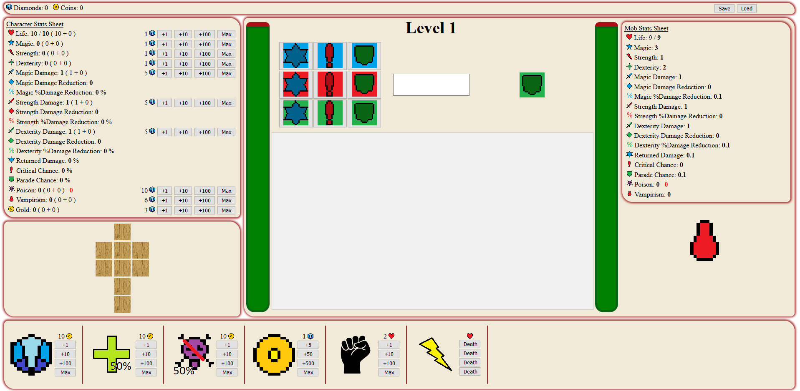

# RogueJS

Petit jeu Rogue Like fait a l'arrache (code dupliqué, aucunes connaissances en js, responsive discutable, ...)

Mais sinon c'est rigolo. A+

# Tutoriel

L'interface est découpée en plusieurs zones:
- Le menu (1)
- La zone de personnage (2)
- La zone de combat (3)
- Le shop (4)

