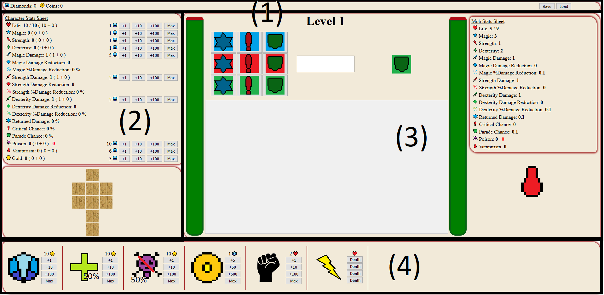
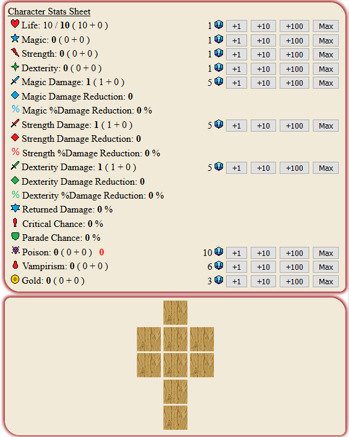
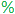
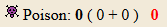

# RogueJS

Petit jeu Rogue Like fait a l'arrache (code dupliqué, aucunes connaissances en js, responsive discutable, ...)

Mais sinon c'est rigolo. A+

# Tutoriel
L'interface est découpée en plusieurs zones:
- Le menu (1)
- La zone de personnage (2)
- La zone de combat (3)
- Le shop (4)

## Menu

Le menu permet d'afficher les diamants et pièces que vous possédez. Vous pouvez ausssi sauvegarder et enregistrer votre partie.
- Diamants: Les diamants sont gardés à la mort
- Pièces: Les pièces sont perdues à la mort

## Zone de personnage

La zone de personnages contient la feuille de stats et les items du personnage (à venir... pitètre).

Statistiques:
- Life: Vie du personnage (à 0 vous êtes mort)
- Magic: Permet d'augmenter les dégats magiques, la %resistance magique et les dommages retournés
- Strength: Permet d'augmenter les dégats physiques, la %resistance physique et les chances de coup critique
- Dexterity: Permet d'augmenter les dégats agiles, la %resistance agile et les chances de parade
- XXX Damage: Dommage de base de type XXX
- XXX Damage Reduction: Dommages réduits fixes (pas encore utilisé (o_o))
- XXX %Damage Reduction: Dommages réduits en %
- Returned Damage: % de dégats renvoyés si vous attaquez en renvoyant les dégats
- Critical Chance: Chance de critique si vous attaquez en tentant un coup critique
- Parade Chance: Chance de parer une attaque si vous attaquez en parant
- Poison: Dot de poison appliqué au monstre à chaque coup porté
- Vampirism: Nombre de PV soigné à chaque coup porté
- Gold: Nombre de pièces gagnées en plus à chaque combat gagné

Calcul des statistiques:
- XXX %Damage Reduction: Math.round(10x40x(1 - 1/(XXX_stats/1000+1)))/10;
- Returned Damage, Critical Chance et Parade Chance: Math.round(10x50x(1 - 1/(XXX_stats/1000+1)))/10;

Remarques:
- Le dot de poison sur le personnage reste entre les combats mais est réinitialisé à la mort 
- Les dots de poison se stacke
- Le vampirisme s'applique uniquement si l'attaque touche et ne dépend pas de la valeur de l'attaque (ie si vous avez 12 de vampirisme et que vous mettez 2 de dégats vous soignerez 12 pv)
