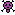

# RogueJS

Petit jeu Rogue Like fait a l'arrache (code dupliqué, aucunes connaissances en js, responsive discutable, ...)

Mais sinon c'est rigolo. A+

# Tutoriel
L'interface est découpée en plusieurs zones:
- Le menu (1)
- La zone de personnage (2)
- La zone de combat (3)
- Le shop (4)

## Menu

Le menu permet d'afficher les diamants et pièces que vous possédez. Vous pouvez ausssi sauvegarder et enregistrer votre partie.
- Diamants: Les diamants sont gardés à la mort
- Pièces: Les pièces sont perdues à la mort

## Zone de personnage

La zone de personnages contient la feuille de stats et les items du personnage (à venir... pitètre).

Statistiques:
- Life: Vie du personnage (à 0 vous êtes mort)
- Magic: Permet d'augmenter les dégats magiques, la %resistance magique et les dommages retournés
- Strength: Permet d'augmenter les dégats physiques, la %resistance physique et les chances de coup critique
- Dexterity: Permet d'augmenter les dégats agiles, la %resistance agile et les chances de parade
- XXX Damage: Dommage de base de type XXX
- XXX Damage Reduction: Dommages réduits fixes (pas encore utilisé (o_o))
- XXX %Damage Reduction: Dommages réduits en %
- Returned Damage: % de dégats renvoyés si vous attaquez en renvoyant les dégats
- Critical Chance: Chance de critique si vous attaquez en tentant un coup critique
- Parade Chance: Chance de parer une attaque si vous attaquez en parant
- Poison: Dot de poison appliqué au monstre à chaque coup porté
- Vampirism: Nombre de PV soigné à chaque coup porté
- Gold: Nombre de pièces gagnées en plus à chaque combat gagné

Calcul des statistiques:
- XXX %Damage Reduction: Math.round(10x40x(1 - 1/(XXX_stats/1000+1)))/10;
- Returned Damage, Critical Chance et Parade Chance: Math.round(10x50x(1 - 1/(XXX_stats/1000+1)))/10;

Cout des statistiques:
- Life, Magic, Strength et Dexterity: value // 100 + 1  (ie 1 de 0 à 100, 2 de 101 à 200, 3 de 201 à 300...)
- XXX Damage: value x 5 + 5 (ie 5 pour 1, 10 pour 2, 15 pour 3...)
- Poison: value x 10 + 10 (ie 10 pour 1, 20 pour 2, 30 pour 3...)
- Vampirism: value x 6 + 6 (ie 6 pour 1, 12 pour 2, 18 pour 3...)
- Gold: value x 3 + 3 (ie 3 pour 1, 6 pour 2, 9 pour 3...)

Remarques:
- Le dot de poison sur le personnage reste entre les combats mais est réinitialisé à la mort 
- Les dots de poison se stackent
- Le vampirisme s'applique uniquement si l'attaque touche et ne dépend pas de la valeur de l'attaque (ie si vous avez 12 de vampirisme et que vous mettez 2 de dégats vous soignerez 12 pv)

## Zone de combat
Barre de vie du personnage, attaques possibles, zone de saisie de votre nombre de tour que vous voulez jouer, intention du mob, barre de vie du mob, stats du mob, zone d'info.

Fonctionnement des attaques:
- La couleur de fond de l'image (bleu, rouge ou vert) correspond à l'élément dans lequel vous ferez des dégats
- L'image correspond à l'effet de l'attaque (renvoit de dégat, coup critique et parade)
- Si vous voulez jouer plusieurs tours de suite de la même manière rentrez le nombre de tour voulu dans la zone de saisie

Par exemple:  Attaque magique avec tentative de coup critique

Déroulement du combat:
- Dot de poison sur le joueur
- Attaque du joueur
- Calcul de critique ou non
- Parade du mob ou non
- Renvoit des degats du mob ou non
- Vampirism + poison sur le mob si l'attaque touche
- Tour du monstre dans le même ordre
